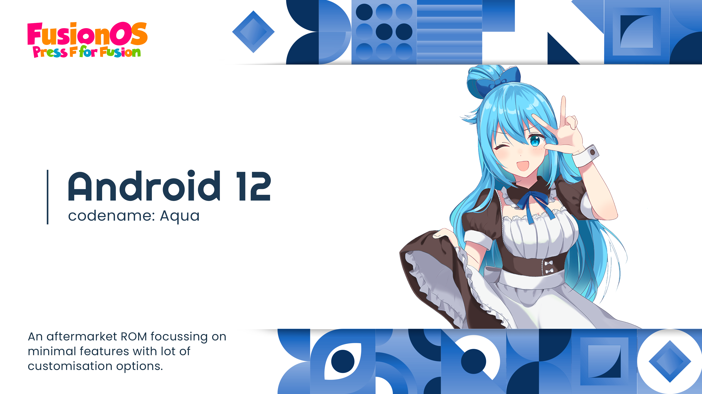

### Requirements
- Around 200G disk space.
- A computer/server with at least 16GB RAM running Linux.
- Capable of syncing 80G of data.
- Some brain cells.

### Instructions
1. Make sure you have a build environment setup. If haven't copy paste from below (works with apt package manager).
```bash
mkdir -p fusion_tmp && cd fusion_tmp && git clone https://github.com/akhilnarang/scripts && bash scripts/setup/android_build_env.sh && cd .. && rm -rf fusion_tmp
```

### Sync ###
```bash
mkdir -p fusion_os && cd fusion_os
repo init -u https://github.com/Fusion-OS/android_manifest -b twelve
repo sync --current-branch --force-sync --no-clone-bundle --no-tags --optimized-fetch --prune -j$(nproc --all)
```

### GAPPS ###
For using GAPPS (Optional)
```bash
WITH_GAPPS := true
```
### Build ###
```bash
source build/envsetup.sh
lunch fuse_$device-userdebug
make fuse-prod -j$(nproc --all)
```

Credits
-------
 * [**AOSP**](https://android.googlesource.com)
 * [**LineageOS**](https://github.com/LineageOS)
 * [**AOSPA**](https://github.com/AOSPA)
 * [**HentaiOS**](https://github.com/hentaios)
 * [**Weeb Project**](https://github.com/weebproject)
 * [**Paranoid Android**](https://github.com/AOSPA)
 * [**Project Radiant**](https://github.com/ProjectRadiant)
 * [**StormbreakerOSS**](https://github.com/StormbreakerOSS)
 * [**ProtonAOSP**](https://github.com/ProtonAOSP)
 * [**StyxOS**](https://github.com/stxyproject)
 * [**Pixel Experience**](https://github.com/PixelExperience)
 * And the list never ends.
